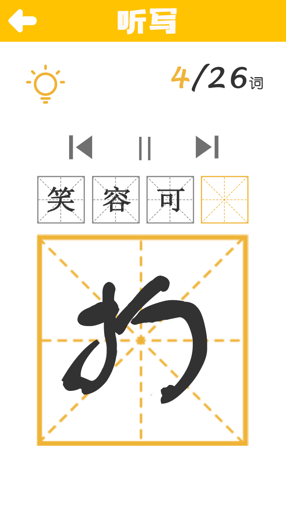

# StudyAssistant

以AppCan进行Hybrid开发，可以同时运行在安卓和iOS系统。

App主要功能是语文助手，学生端可以进行词语听写，识别手写输入的文字。

教师端可以发布听写的词语，创建教室。

和同学一起完成这个项目，本人负责前端部分，并负责了PS设计部分。

## 主要技术

客户端：Appcan引擎 + jQuery+科大讯飞接口

后端 Express + Mysql

## 主要界面示意

